 
## 查看主页获取源码

### 一、作品包含

源码+数据库+设计文档万字+PPT+全套环境和工具资源+部署教程

### 二、项目技术

前端技术：Html、Css、Js、Vue、Element-ui

数据库：MySQL

后端技术：Java、Spring Boot、MyBatis

  

### 三、运行环境

开发工具：IDEA/eclipse

数据库：MySQL5.7

数据库管理工具：Navicat10以上版本

环境配置软件： JDK1.8+Maven3.6.3

前端Nodejs：14

### 四、项目介绍
项目编号：springbootA229

零食销售系统在现代零售业中扮演着越来越重要的角色，它通过整合线上线下销售渠道，为消费者提供了便捷的购物体验。在快节奏的生活模式下，零食销售系统不仅满足了人们对多样化、个性化零食的需求，同时也助力商家实现销售数据的实时监控、库存管理的优化以及市场趋势的快速响应，从而推动零食行业的持续发展和创新。

前台用户功能：浏览首页、零食信息、公告信息、在线客服、购物车、个人中心。

后台管理员的功能：系统首页、个人中心、用户管理、零食种类管理、零食信息管理、系统管理、订单管理。

### 五、运行截图

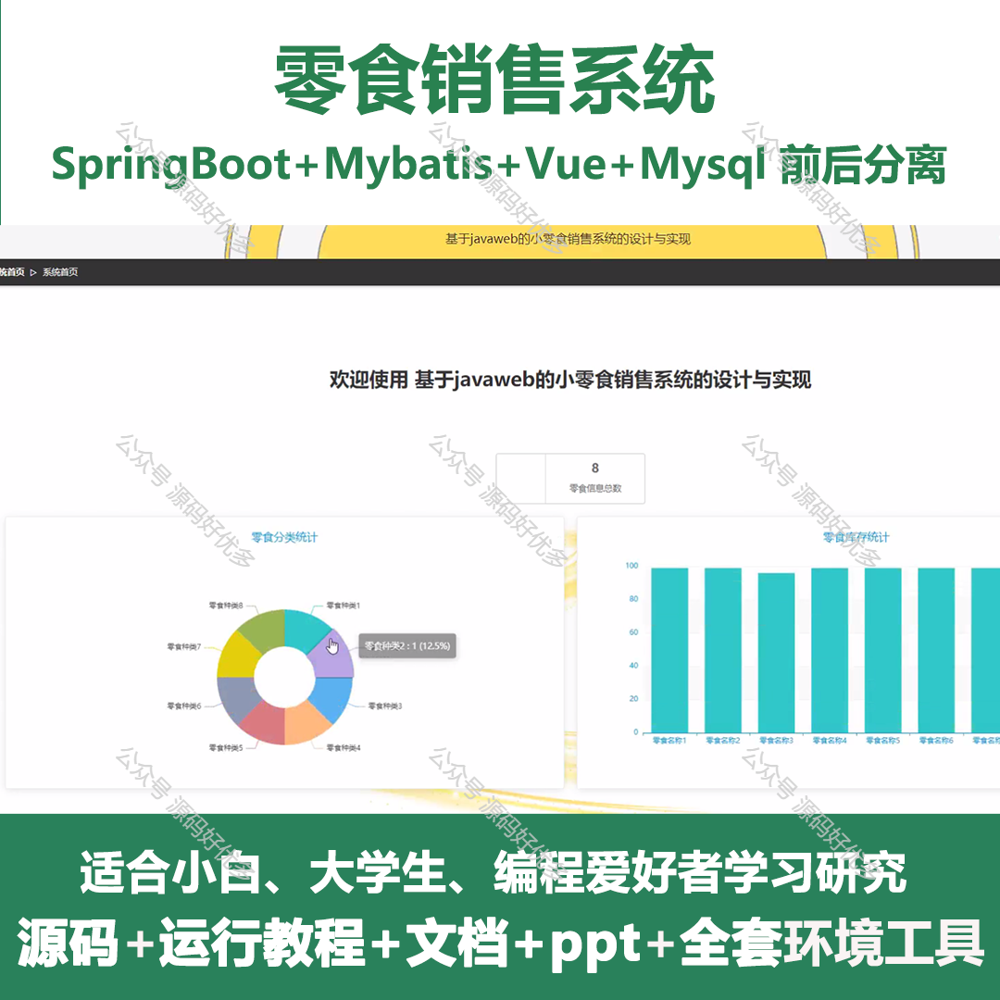
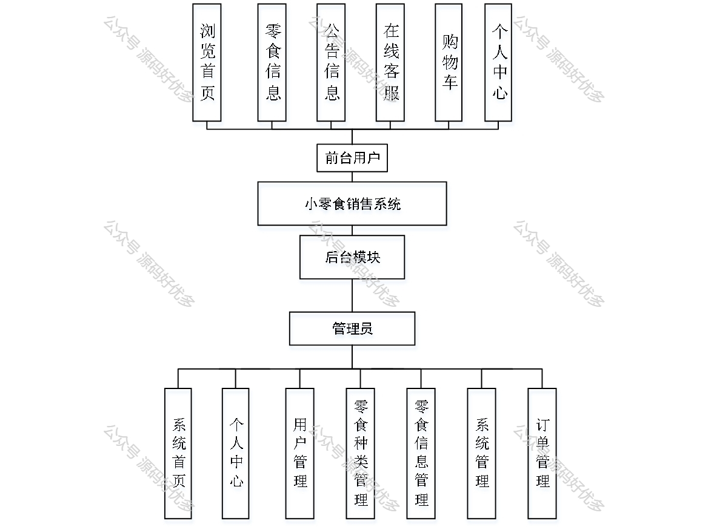
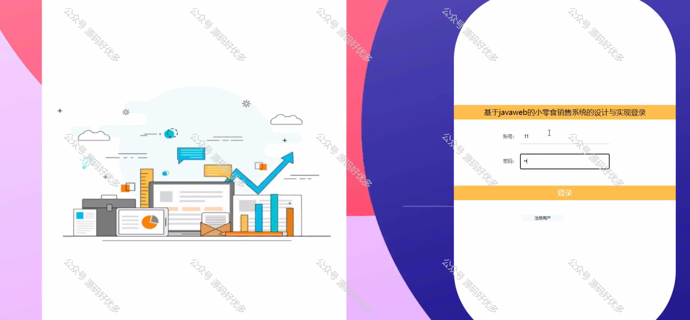
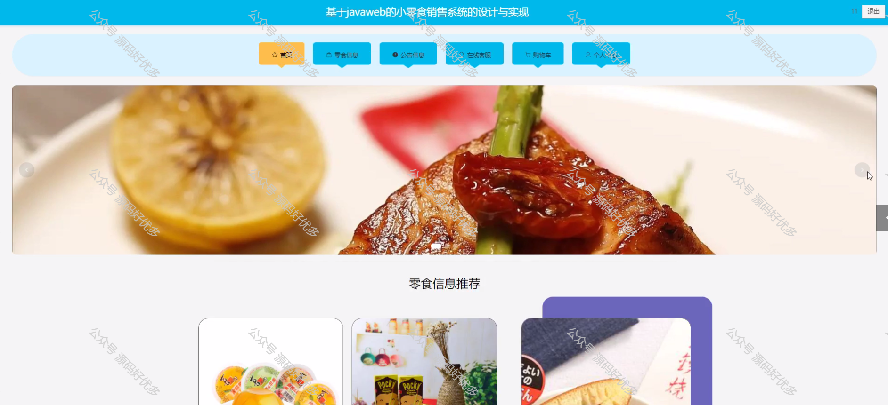
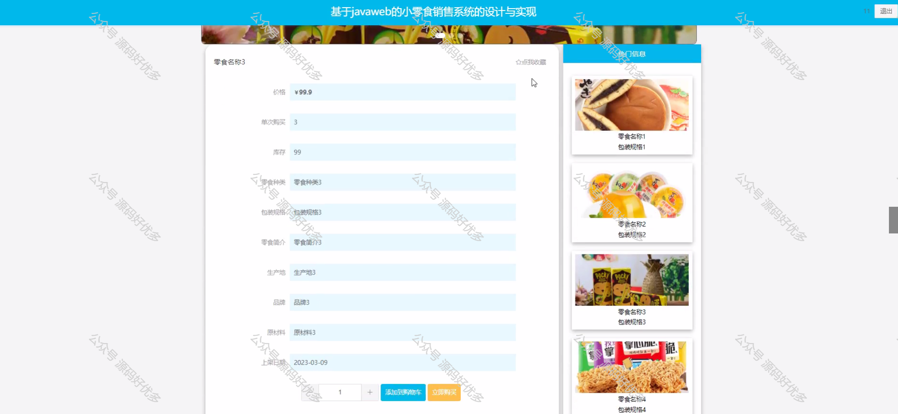
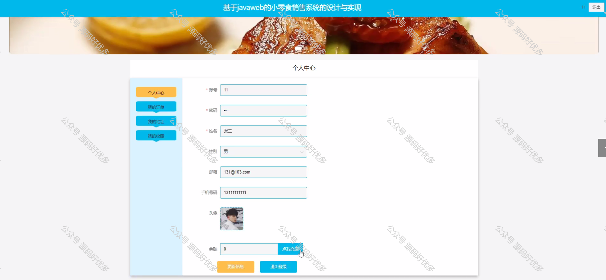
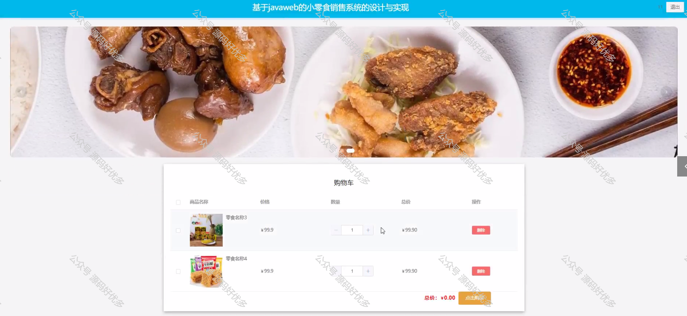
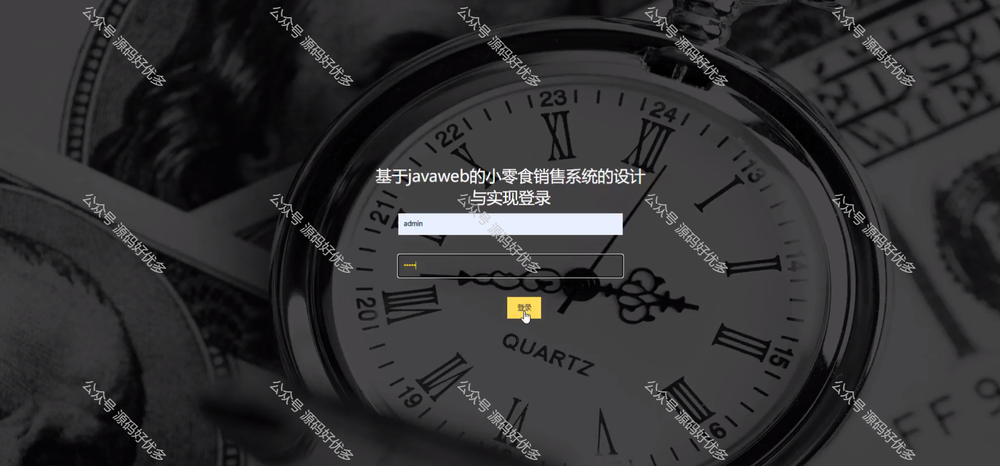
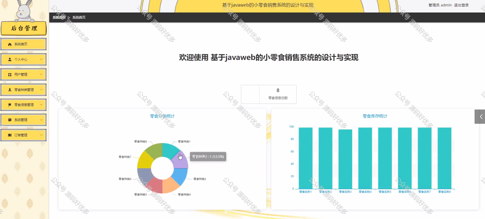
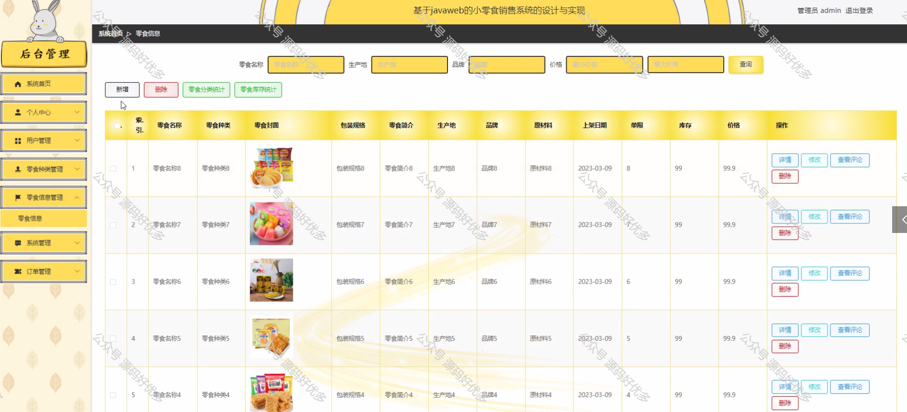
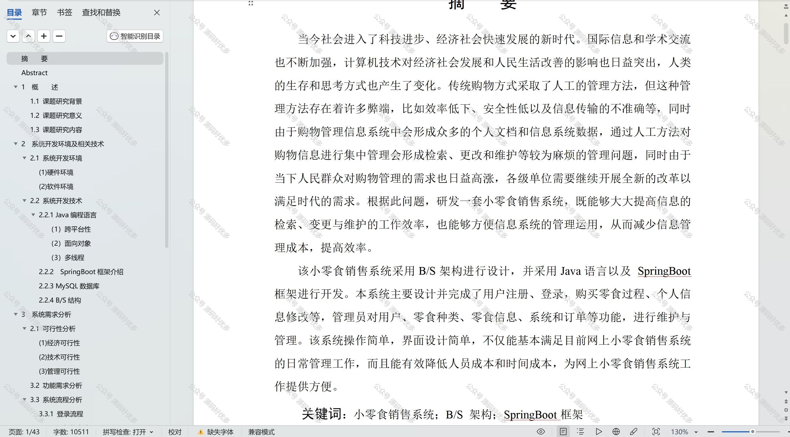

  
